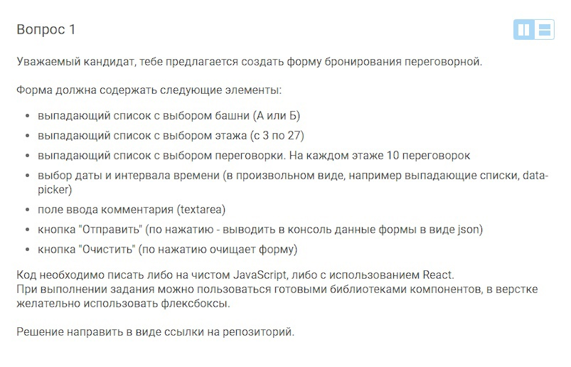

# Проект: Booking-form-vanillaJS

---

## Тестовое задание выглядит так:

### Обзор

- Описание проекта и его функциональности
- Используемые технологии
- Какие команды нужно выполнить для сборки и запуска проекта?
- Ссылка на GitHub Pages

## Описание проекта и его функциональности

Проект представляет из себя форму для бронирования переговорной комнаты.

## Используемые технологии

- Для написания сайта использовалась технология HTML.

- Для придания сайту привлекательного и уникального внешнего вида использовалась технология CSS.

- С помощью языка программирования Java Script сайт стал интерактивным.

- Для сборки проекта использовался Webpack.

## Какие команды нужно выполнить для сборки и запуска проекта:

- Склонируйте репозиторий с проектом на свой локальный компьютер: **git clone git@github.com:Allison4444/booking-form-vanillaJS.git**  

- Перейдите в каталог проекта: **cd booking-form-vanillaJS**  

- Установите все зависимости, необходимые для проекта: **npm install**  

- Запустите проект в режиме разработки: **npm run dev** Эта команда запустит локальный сервер и откроет приложение в вашем браузере по адресу **http://localhost:8080**.  

- Для сборки проекта в продакшн режиме, используйте команду: **npm run build** Эта команда создаст оптимизированную версию проекта в папке build.  

Эти команды должны быть достаточными для запуска и сборки проекта **booking-form-vanillaJS**. Обязательно убедитесь, что у вас установлен Node.js и npm, чтобы эти команды работали.

## Ссылка на GitHub Pages

**https://allison4444.github.io/booking-form-vanillaJS/**
